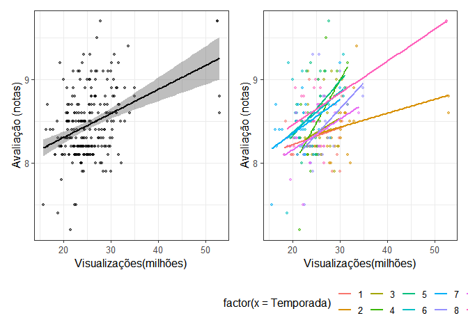

<!-- README.md is generated from README.Rmd. Please edit that file -->

# Análise da base de dados do pacote Friends

<!-- badges: start -->
<!-- badges: end -->
<p>

O objetivo deste projeto foi realizar algumas análises da base de dados
do pacote *Friends*. Embora eu nunca nem tenha assistidp a série, a
motivação para este projeto partiu do *Meetup* [Conhecendo o ggplot2:
criando gráficos com R](https://www.youtube.com/watch?v=lkX9ms1eX10)
realizado pelo @RladiesSP no dia 26 de junho de 2021 pela Letícia
Thomaz. A Letícia deu boas dicas para construir gráficos usando o pacote
**ggplot2** e, com isso, resolvi reproduzir o exercício realizado no
*Meetup* para praticar e ainda tentei utilizar outras ferramentas do R.

``` r
# Carregandos pacotes que serão utilizados
library(friends)
library(patchwork)
library(ggplot2)

# Criando objeto e visualizando a base de dados 

b <- friends::friends_info

head(b)
#> # A tibble: 6 x 8
#>   season episode title      directed_by written_by   air_date   us_views_millio~
#>    <int>   <int> <chr>      <chr>       <chr>        <date>                <dbl>
#> 1      1       1 The Pilot  James Burr~ David Crane~ 1994-09-22             21.5
#> 2      1       2 The One w~ James Burr~ David Crane~ 1994-09-29             20.2
#> 3      1       3 The One w~ James Burr~ Jeffrey Ast~ 1994-10-06             19.5
#> 4      1       4 The One w~ James Burr~ Alexa Junge  1994-10-13             19.7
#> 5      1       5 The One w~ Pamela Fry~ Jeff Greens~ 1994-10-20             18.6
#> 6      1       6 The One w~ Arlene San~ Adam Chase ~ 1994-10-27             18.2
#> # ... with 1 more variable: imdb_rating <dbl>
```

# Relação entre número de visualizações e a nota

A base de dados disponível no pacote *Friends* (*friends\_info*)
consiste de uma tabela com informações sobre cada um dos episódios da
série obtidas na Wikipedia e IMDb (*Internet Movie Database*) em 26 de
agosto de 2020. No primeiro momento tentei verificar a relização entre o
número de visualizações com nota do episódeo. Na minha opinião, faz todo
o sentido lógico, que os episódios com maiores notas apresentam maior
número de visualizações seja considerando cada temporada ou todas
temporadas concomitantemente.  

Como podemos observar na figura acima e a esquerda, os dados apresentam
uma relação linear entre número de visualizações e a nota do episódios
quando considerado todas as temporadas cada temporada isolada. Essa
primeira análise confirma minha assunção de que quanto melhor a nota,
maior é o número de visualizaçãoes, em outras palavras, quanto mais
legal o episódio, maior o número de visualizações.

# Número de visualizações por por temporada
