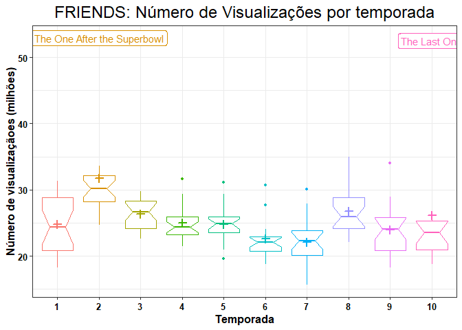
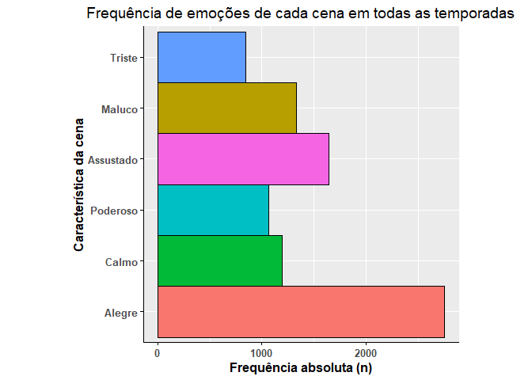
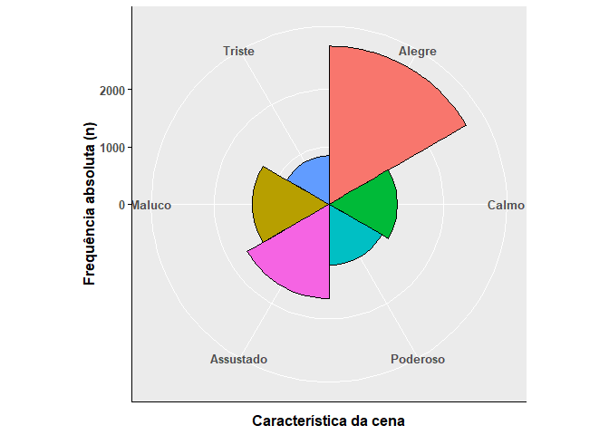

# Análise da base de dados do pacote FRIENDS

<!-- badges: start -->
<!-- badges: end -->
<p>

O objetivo deste projeto foi realizar algumas análises da base de dados
do pacote *FRIENDS*. Embora eu nunca nem tenha assistido a série, a
motivação para este projeto partiu do *Meetup* [Conhecendo o ggplot2:
criando gráficos com R](https://www.youtube.com/watch?v=lkX9ms1eX10)
realizado pelo @RladiesSP no dia 26 de junho de 2021 pela Letícia
Thomaz. A Letícia deu boas dicas para construir gráficos usando o pacote
**ggplot2** e, com isso, resolvi reproduzir o exercício realizado no
*Meetup* para praticar e ainda tentei utilizar outras ferramentas do R.

``` r
# Carregandos pacotes que serão utilizados
library(friends)
library(patchwork)
library(ggplot2)

# Criando objeto e visualizando a base de dados 

b <- friends::friends_info

head(b)
#> # A tibble: 6 x 8
#>   season episode title      directed_by written_by   air_date   us_views_millio~
#>    <int>   <int> <chr>      <chr>       <chr>        <date>                <dbl>
#> 1      1       1 The Pilot  James Burr~ David Crane~ 1994-09-22             21.5
#> 2      1       2 The One w~ James Burr~ David Crane~ 1994-09-29             20.2
#> 3      1       3 The One w~ James Burr~ Jeffrey Ast~ 1994-10-06             19.5
#> 4      1       4 The One w~ James Burr~ Alexa Junge  1994-10-13             19.7
#> 5      1       5 The One w~ Pamela Fry~ Jeff Greens~ 1994-10-20             18.6
#> 6      1       6 The One w~ Arlene San~ Adam Chase ~ 1994-10-27             18.2
#> # ... with 1 more variable: imdb_rating <dbl>
```

# Relação entre número de visualizações e a nota

A base de dados disponível no pacote *Friends* (*friends\_info*)
consiste de uma tabela com informações sobre cada um dos episódios da
série obtidas na Wikipédia e IMDb (*Internet Movie Database*) em 26 de
agosto de 2020. No primeiro momento verifiquei a relação entre o número
de visualizações com nota do episódio. Numa perspectiva lógica, faz todo
o sentido que os episódios com maiores notas apresentem maior número de
visualizações.  

Após realizada a análise de observação gráfica, pode-se observar na
figura acima que os dados apresentam uma relação linear entre número de
visualizações e a nota do episódios quando considerado todas as
temporadas (figura a esquerda) ou cada temporada isolada (figura a
direita). Essa primeira análise confirma a assunção de que quanto melhor
a nota, maior é o número de visualizações, ou seja, quanto mais “legal”
o episódio, maior o número de visualizações.

# Número de visualizações por por temporada

Numa segunda perspectiva foi analisado os valores descritivos do número
de visualizações em cada uma das 10 temporadas de série. Para isso, foi
criado um boxplot para que pudessemos visualizar os valores do primeiro,
segundo (i.e., mediana) e terceiro quartil, valores mínimo e máximo
desconsiderando os outliers e os outliers. Além disso, foi criada uma
base agrupada por temporada no qual foi calculado a média e inserida no
gráfico (expresso com o símbolo “+”). Segue abaixo o código utilizado
para criação do gráfico.

``` r
# Sumarizar (media e mediana) por temporada -------------------------------

bgrouped <-
  friends::friends_info |>
  dplyr::group_by(season) |>
  dplyr::summarise(mean_views = mean(us_views_millions),
                   median_views = median(us_views_millions))

# Dois episódios mais assistidos ------------------------------------------

top_2 <-
  friends::friends_info |>
  dplyr::arrange(desc(us_views_millions)) |>
  dplyr::select(season, title, us_views_millions) |>
  head(4) |>
  dplyr::distinct()

# Criando boxplot por temporada -------------------------------------------

camada1 <-
  friends::friends_info |> # boxplot por temporada
  ggplot(mapping = aes(x = factor(season),
                       y = us_views_millions,
                       color = factor(season))) +
  geom_boxplot(outlier.size = 1,
               notch = TRUE,
               show.legend = FALSE)

camada2 <- camada1 + # Inserindo valor da média
  geom_point(data = bgrouped,
             mapping = aes(x = factor(season),
                           y = mean_views),
             show.legend = FALSE,
             shape = 3,
             size = 2,
             stroke = 1.5
             )

camada3 <-  camada2 + # Rotulando as 2 maiores visualizações
  geom_label(data = top_2,
             mapping = aes(x = factor(season),
                           y = us_views_millions,
                           label = title),
             show.legend = FALSE
            ) +
   labs(title = "FRIENDS: Número de Visualizações por temporada",
       x = "Temporada",
       y = "Número de visualizaçãoes (milhões)") +
    theme_bw() +
    theme(plot.title = element_text(family = "Times New Roman",
                                    size = 18,
                                    hjust = 0.5),
          axis.title = element_text(size = 12, face = "bold"),
          axis.text = element_text(color = "black", size = 10, face = "bold")
    )

camada3
```



Após inspeção visual é possível verificar que a temporada com maior
número ibope, ou seja, maior número médio de visualizaçãoes foi a
segunda temporada com mais de 30 milhoes visualizações. Após esse pico
de ibope da série e com a excessão da temporada 8 que apresentou um
elevado ibope, os valores médios de cada temporada foram reduzindo de
forma progressiva atingindo a menor visualização nas temporadas 6 e 7. A
temporada 8, em particular, embora apresente valor médio de
visualizações menor do que aquele observado na temporada 2, esa
tempoerada apresenta o episódio com maior número de visualização,
ilustrando uma melhora no ibope da série que se aproxima da melhor
temporada de FRIEDS (temporada 2). Por fim, vale destacar que na
temporada 2 e 10, o episódio “The One After the Superbowl” e “The Last
One”, respectivamente, tiveram mais de 50 milhões de visualizações,
sendo os 2 recordistas de ibope de toda a temporada da série FRIENDS.

# Qual o gênero da série FRIENDS?

Como mencionado, eu nunca assisti a série e, por conta disso, eu
desconheço o gênero da série. Neste sentido, ao visualizar as bases de
dados disponíveis no pacote FRIENDS, notei que uma delas (i.e.,
friends::friends\_emotions) tinha a “emoção” predominante de cada cena
ao longo de toda a série. Com isso, vi a oportunidade de tentar
descobrir qual é o gênero da série. A partir daí, filtrei as observações
que continham cenas “neutras” e fiz um gráfico de barras (e um
*piechart*) para verificar qual era a emoção mais frequente. Após está
análise, pude observar que as cenas alegres (*Joyful*) eram as mais
frequentes (vide figura abaixo) e, consequentente, assumi que a série é
uma comédia.

Para confirmar minha conclusão de que a série FRIENDS é um série de
comédia, fui checar no
[Wikipédia](https://pt.wikipedia.org/wiki/Friends) as informações sobre
a série e, de fato, a série é uma série de comédia, mais
especificamente, *Sitcom*, que significa *situation* *comedy*.

# Considerações Finais

Após analisada a base de dados do pacote FRIENDS pode-se notar que, como
esperado, o número de visualizações parece estar diretamente associado
com a nota do episódio segundo a IMDb, *Internet Movie Database*. Também
foi possível identificar que o número de visualizações foi maior no
início da temporada, em particular na 2°, e, em seguida, houve uma queda
no ibope da série. Por fim, como eu não conheço a série, tentei
identificar qual o gênero por meio das bases de dados disponíveis no
pacote e, conforme minha análise sugeriu, a série, de fato, é do gênero
comédia.
